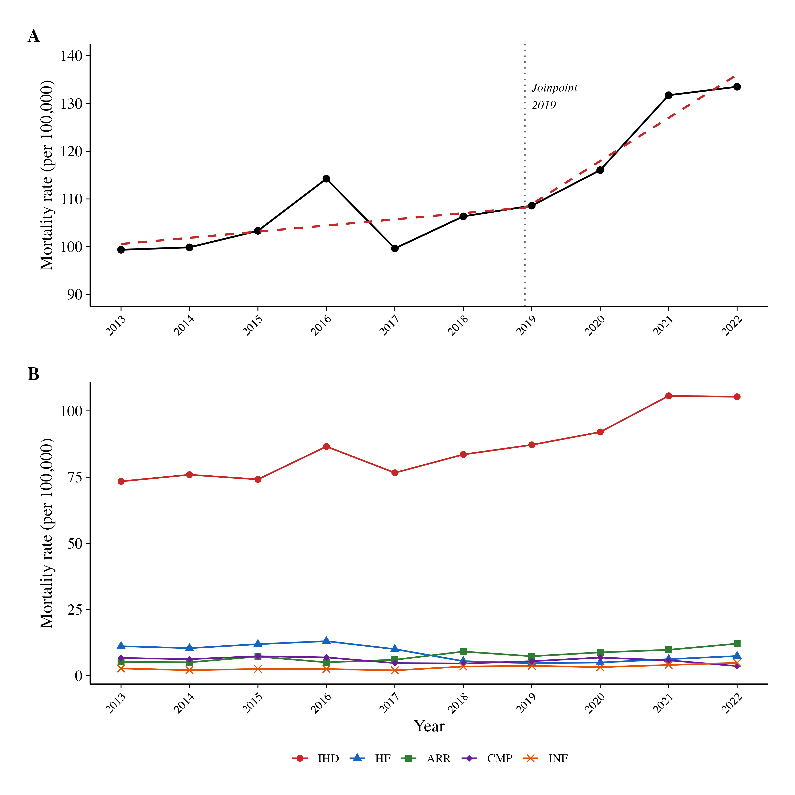
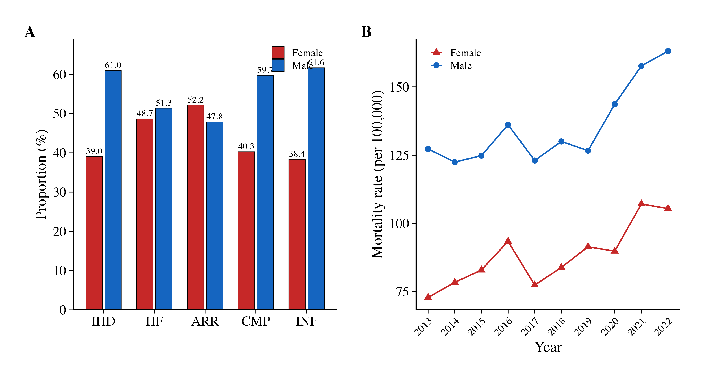
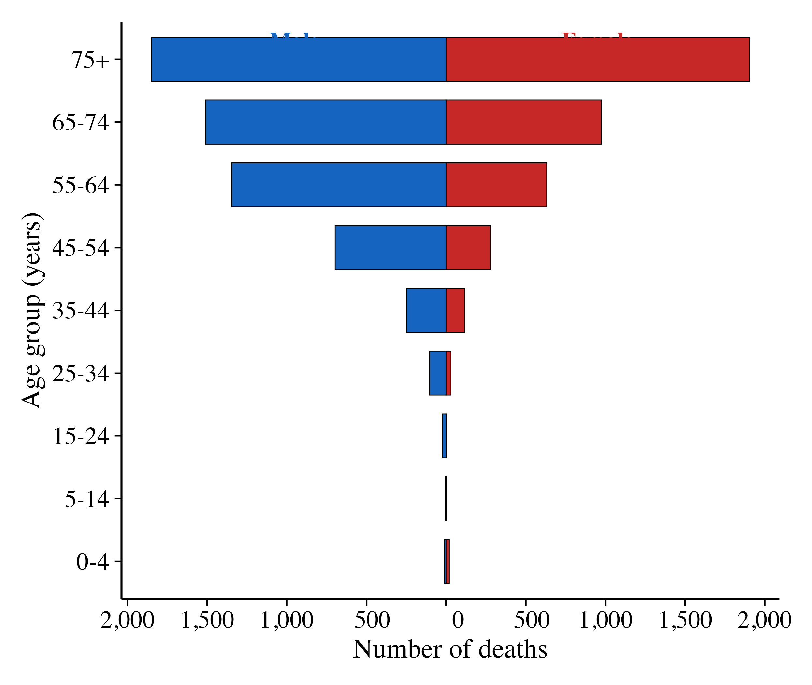
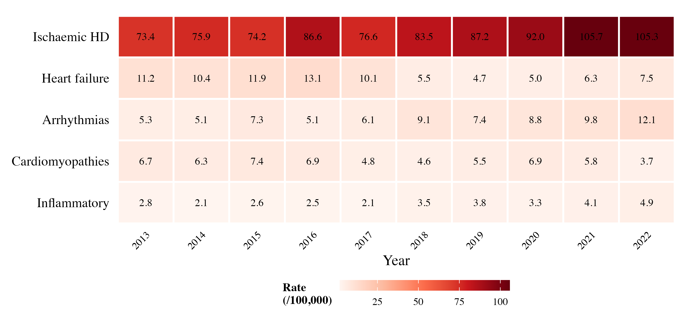
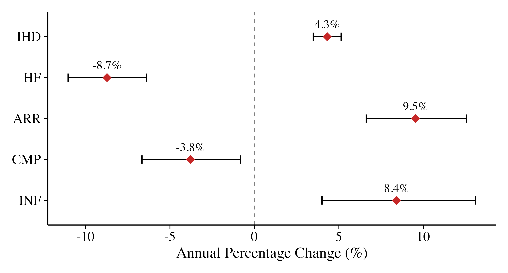

# Cardiovascular Disease Mortality in Campo Grande, Brazil (2013–2022)

> **Temporal trends and epidemiological profile of cardiovascular disease mortality in Campo Grande, Mato Grosso do Sul, Brazil, 2013–2022**

[](https://www.r-project.org/)
[](https://creativecommons.org/licenses/by/4.0/)
[](https://datasus.saude.gov.br/)
[](https://memorias.ioc.fiocruz.br/)

---

## Overview

This repository contains the **complete reproducible analysis** and **manuscript** for an ecological, descriptive, retrospective study of cardiovascular disease (CVD) mortality in Campo Grande, capital of Mato Grosso do Sul, Brazil, from 2013 to 2022.

The study analyses **9,791 cardiac deaths** from the Brazilian Mortality Information System (SIM), classified into five pathophysiological groups, using Poisson regression, Prais-Winsten regression, and joinpoint analysis.

---

## Key Findings

| Finding | Value |
|---|---|
| Total cardiac deaths | 9,791 (12.8% of all deaths) |
| Dominant group | Ischaemic heart disease (77.4%) |
| Overall annual increase | **+3.3%/year** (95% CI: 2.5–4.0) |
| Male excess mortality | **IRR = 1.59** (95% CI: 1.47–1.72) |
| IHD deaths at home | **38.1%** (vs 40.0% in hospital) |
| Joinpoint (acceleration) | **2019** — COVID-19 pandemic effect |
| Pandemic excess | **+15.3%** (2020–2021 vs 2018–2019) |

### Trend by Disease Group

| Group | APC (Poisson) | Prais-Winsten |
|---|---|---|
| Ischaemic heart disease | +4.3% (p < 0.001) | Increasing |
| Arrhythmias | +9.5% (p < 0.001) | Increasing |
| Inflammatory | +8.4% (p < 0.001) | Increasing |
| Heart failure | −8.7% (p < 0.001) | Stationary |
| Cardiomyopathies | −3.8% (p = 0.012) | Stationary |

---

## Figures

### Fig. 1 — Temporal Trends in Cardiovascular Mortality

**(A)** Overall crude mortality rate with joinpoint regression (dashed red line); dotted vertical line = breakpoint at 2019. **(B)** Disease-specific rates. IHD: ischaemic heart disease; HF: heart failure; ARR: arrhythmias; CMP: cardiomyopathies; INF: inflammatory.

---

### Fig. 2 — Sex-Specific Analysis

**(A)** Proportional distribution by sex across disease groups. **(B)** Sex-specific mortality rates over time.

---

### Fig. 3 — Age–Sex Pyramid

Population pyramid of cardiovascular deaths showing concentration in the 65–74 and 75+ age groups, with male predominance across most age strata.

---

### Fig. 4 — Mortality Heatmap

Heatmap of disease-specific mortality rates (per 100,000) by year. Darker shading = higher rates. Note the progressive intensification of IHD from 2019 onward.

---

### Supplementary Figure S4 — Forest Plot (APC)

Annual percentage change (APC) with 95% confidence intervals by disease group. Diamond = point estimate; horizontal bars = 95% CI.

---

## Repository Structure

```
cardiovascular-mortality-campo-grande/
│
├── README.md                          # This file
├── .gitignore                         # Git ignore rules
│
├── analise_final.R                    # Main reproducible R script
├── analise_cardiovascular.R           # Earlier version (archived)
│
├── dados_cardio.csv                   # Raw SIM data (9,792 records)
├── dados_cardio.rds                   # R binary format
├── primeira versao_Joao_Vitor.docx    # Initial draft (Portuguese)
├── manuscript_MIOC.txt                # Manuscript plain text (archived)
│
└── output/                            # All generated outputs
    ├── Manuscript_MIOC_complete.docx   # FINAL MANUSCRIPT (Word, with figures)
    ├── Table_I.docx                   # Formatted Table I (gtsummary)
    ├── Table_II.csv                   # Crude & age-standardised rates
    ├── Table_III.csv                  # Model results (Poisson + Prais-Winsten)
    ├── Fig1.png / Fig1.tiff           # Temporal trends (600 dpi)
    ├── Fig2.png / Fig2.tiff           # Sex distribution (600 dpi)
    ├── Fig3.png / Fig3.tiff           # Age-sex pyramid (600 dpi)
    ├── Fig4.png / Fig4.tiff           # Heatmap (600 dpi)
    ├── FigS1.png                      # Place of death (supplementary)
    ├── FigS2.png                      # Age density curves (supplementary)
    ├── FigS3.png                      # Crude vs age-standardised (supplementary)
    ├── FigS4_forest.png               # APC forest plot (supplementary)
    ├── Table_S1.csv                   # ICD-10 detail by group
    ├── Table_S2.csv                   # Age-specific rates
    └── Table_S3.csv                   # Data completeness
```

---

## Methodology

### Study Design
- **Type:** Ecological, descriptive, retrospective
- **Period:** 2013–2022 (10 years)
- **Setting:** Campo Grande, MS, Brazil (pop. ~898,100 in 2022)
- **Data source:** Sistema de Informações sobre Mortalidade (SIM)
- **Ethics:** CAAE 74807523.7.0000.0021 (UFMS)

### Disease Classification (ICD-10)

| Group | ICD-10 Codes | Abbreviation |
|---|---|---|
| Ischaemic heart disease | I20–I25 | IHD |
| Heart failure | I50–I52 | HF |
| Arrhythmias & conduction disorders | I44–I49 | ARR |
| Cardiomyopathies | I42–I43 | CMP |
| Inflammatory heart diseases | I30–I41 | INF |

### Statistical Methods

| Method | Purpose | R Package |
|---|---|---|
| Poisson regression | Annual percentage change (APC) | `stats::glm` |
| Negative binomial regression | APC with overdispersion correction | `MASS::glm.nb` |
| Prais-Winsten regression | Trend with autocorrelation correction | Manual (Cochrane-Orcutt) |
| Joinpoint analysis | Identify inflection points | `segmented` |
| Direct age-standardisation | WHO standard population weights | Manual calculation |
| Chi-squared / Kruskal-Wallis | Group comparisons | `stats` |

---

## How to Reproduce

### Requirements

- **R >= 4.5.0**
- Required packages (auto-installed by script):
  `tidyverse`, `janitor`, `gtsummary`, `flextable`, `scales`, `broom`, `MASS`, `patchwork`, `segmented`, `officer`, `knitr`, `kableExtra`, `ggrepel`, `RColorBrewer`, `grid`, `gridExtra`

### Run

```r
# Clone the repository
# git clone https://github.com/Audency/cardiovascular-mortality-campo-grande.git

# Open R and run:
source("analise_final.R")

# All outputs will be generated in the output/ directory
```

---

## Manuscript

The complete manuscript formatted for **Memórias do Instituto Oswaldo Cruz** is available at:

**[`output/Manuscript_MIOC_complete.docx`](output/Manuscript_MIOC_complete.docx)**

It includes:
- Structured abstract (BACKGROUND / OBJECTIVES / METHODS / FINDINGS / MAIN CONCLUSIONS)
- Introduction with 36 references
- Full Materials and Methods (three statistical approaches)
- Results with embedded figures (Fig. 1–4)
- Discussion comparing with national and international literature
- 36 peer-reviewed references in MIOC author-date style

---

## Data Sources

| Source | Description |
|---|---|
| [SIM/DATASUS](https://datasus.saude.gov.br/) | Mortality Information System — death records |
| [IBGE/SIDRA](https://sidra.ibge.gov.br/) | Population estimates and Census 2022 |
| [WHO Standard Population](https://www.who.int/healthinfo/paper31.pdf) | Age-standardisation weights |

---

## Authors

- **João Vitor [Sobrenome]** — Study design, data collection, analysis, manuscript
- **Everton Falcão de Oliveira** — Supervision, methodology, revision
- **Audêncio Victor [Sobrenome]** — Statistical modelling, code, revision

**Institutional affiliation:** Universidade Federal de Mato Grosso do Sul (UFMS), Faculdade de Medicina, Campo Grande, MS, Brazil

---

## Citation

If you use this code or data, please cite:

```
[Sobrenome] JV, Oliveira EF, [Sobrenome] AV. Temporal trends and epidemiological
profile of cardiovascular disease mortality in Campo Grande, Mato Grosso do Sul,
Brazil, 2013–2022. Mem Inst Oswaldo Cruz. 2026; [submitted].
```

---

## License

This work is licensed under [CC BY 4.0](https://creativecommons.org/licenses/by/4.0/). You are free to share and adapt the material with appropriate attribution.
